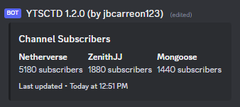
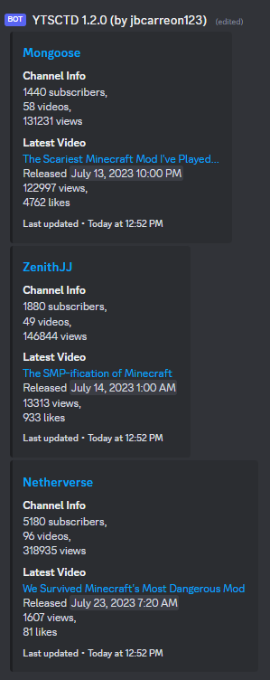
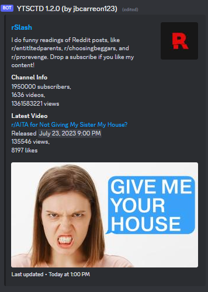

# YoutubeSubCountToDiscord
Get subscriber count of one or multiple channels, and outputs it as a Discord Webhook.

## YouTube tutorial
[](http://www.youtube.com/watch?v=BT2Y8DAEKMk)

## Embed modes
### Basic Mode
  
In Basic mode, the thing shown is only the channel name, and the subscriber count.  
Useful for subscriber comparisons, or like shown in the example (subscribe to [Netherverse](https://youtube.com/@netherverseyt), [Zenith](https://youtube.com/@zenithjj), and [Mongoose](https://youtube.com/@mongoose.). First one to reach 10k wins.), for subscriber races.
### Simple Mode
  
In Simple Mode, each channel now gets it's own embed, and it now shows their latest video.  
Also, the statistics is now extended, with videos, and views.  It now also have clickable links.
### Verbose Mode
  
In Verbose mode, it now shows the channel's image, the latest video's thumbnail, and the channel's description.
#### Notes about Simple and Verbose Modes
In each of them, it costs 2 quota units per channel per interval to show the latest video.
#### Also,
If you want to take down your channel in the examples, send me an email at `jbcarreon212@gmail.com` (make sure it is marked as important!)

## Limitations
In Basic mode, it is limited to 25 channels. That's because a single Discord embed can only contain 25 fields.  
In both Simple and Verbose modes, it is limited to 10 channels. That's because a single Discord webhook message can only contains 10 embeds.  
See this: https://discord.com/safety/using-webhooks-and-embeds

## Default config
```json
{
  // Embed Mode. Default: "SIMPLE"
  // BASIC = Only 1 embed, and shows only the channel name, and the subscriber count.
  // SIMPLE = 1 embed each channel, and shows the channel name, the statistics (subscribers, videos, and views),
  // and the latest video and it's statistics.
  // VERBOSE = Like simple mode, but with description, and images of both the channel, and the latest video.
  // Note that both SIMPLE and VERBOSE mode also costs (aside from the interval quota cost of 1 per interval)
  // 2 quota units per channel per interval to get the latest video, and it's statistics.
  "Mode": "VERBOSE",

  // Your YouTube API key. For security purposes, I won't add my API key here.
  // https://developers.google.com/youtube/v3/getting-started
  "YtApiKey": "[INSERT API KEY HERE]",

  // The application name you specified on Google Developer Console.
  "YtApiName": "[INSERT APP NAME HERE]",

  // Your Discord webhook URL.
  // The name of the bot does not matter.
  // https://support.discord.com/hc/en-us/articles/228383668-Intro-to-Webhooks
  "DiscordWebhookToken": "[INSERT WEBHOOK URL HERE]",

  // What channels you want to get the subscriber count?
  // Uses channel IDs. Accepts multiple channel IDs using a comma-separated list.
  // https://support.google.com/youtube/answer/3250431?hl=en.
  // This also accepts channels that you don't own.
  "Channels": "[CHANNEL 1 ID HERE],[CHANNEL 2 ID HERE]",

  // What is the delay of updating the channels? Default: 300 seconds (5 minutes, 388 requests on BASIC).
  // Accepts seconds. 1 minute = 60 seconds.
  // On SIMPLE and VERBOSE mode, it costs 1 unit per interval (to get the channel's info) + 2 units per channel per interval (to get the latest video).
  // Please note that YouTube API has a quota limit of 10000 per day, and each request of this program costs 1 quota.
  "UpdateInterval": 300,

  // If you want the webhook to not create a new message for every reboot, add a message ID here. Default: 0 (disabled).
  // To make it work and make sure the program won't crash, use an ID of a message that the webhook created.
  // To get the message ID, enable Developer Mode on advanced settings in Discord, right-click the webhook's message, and click Copy Message ID.
  // https://support.discord.com/hc/en-us/articles/206346498-Where-can-I-find-my-User-Server-Message-ID-
  "WebhookMessageIdOverride": 0,

  // Destination of the CSV file. Default: "" (disabled)
  // NOTE: This will only update the file once per interval.
  "CSVFileDestination": "",

  // Forcely assume that the file exists and the data only needs to be appended?
  "ForceAppendCSV": false
}
```

## Dependencies
Google.Apis.Youtube.v3  
Discord.Net  
Newtonsoft.Json

## Disclaimer
YouTube is a trademark by Google Inc., and  
Discord is a trademark by Discord Inc.
This program isn't endorsed or affiliated by Google or Discord.
